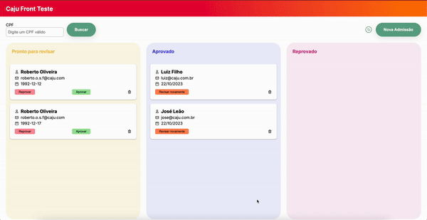

# 🚀 Plataforma de Admissão 🚀

Este é o repositório da **Plataforma de Admissão**, uma aplicação web para gerenciamento de admissões. A aplicação possui duas telas principais: **Dashboard**, para visualização e gerenciamento de admissões, e **Cadastro**, para inclusão de novas admissões.

Abaixo está um exemplo da interface da tela de Dashboard:



## Funcionalidades

### Tela Dashboard

- **Listagem**: Visualize todas as admissões existentes.
- **Filtragem**: Filtre os cards por coluna com base no status (REVIEW, APPROVED, REPROVED).
- **Ações**:
  - Aprovar: Altere o status para `APPROVED`.
  - Reprovar: Altere o status para `REPROVED`.
  - Revisar novamente: Altere o status para `REVIEW`.
  - Excluir: Remova a admissão.
- **Busca**: Pesquise admissões por CPF com validação automática.
- **Atualização**: Atualize a lista ao clicar no ícone de atualizar.
- **Confirmação e Notificações**:
  - Modal para confirmar ações.
  - Notificações de sucesso ou erro.
- **Carregamento**: Indicador de carregamento durante requisições.

### Tela Cadastro

- **Formulário**:
  - Validação de campos:
    - `Email`: Aceita apenas emails válidos.
    - `Nome Completo`: Deve conter pelo menos duas palavras, sem números no início.
    - `CPF`: Aceita apenas CPFs válidos, com máscara de entrada.
  - Redirecionamento: Após criar uma nova admissão, o usuário é redirecionado para o Dashboard.
- **Envio**:
  - Criação de uma nova admissão com validação e feedback.

---

## Como Rodar o Projeto Localmente

### Pré-requisitos

- Node.js
- Yarn (ou npm)

### Passos

1. Clone o repositório e instale as dependências:

```bash
git clone git@github.com:betonix/front-registrations.git
cd front-registrations
yarn install
```

2. Inicie o servidor JSON para consumir a API:

```bash
yarn init:db
```

3. Inicie a aplicação:

```bash
yarn dev
```

URLs Disponíveis

    •	Aplicação: http://localhost:3001
    •	Servidor JSON: http://localhost:3000

Rodar Testes

```bash
yarn test:dev
```

Tecnologias Utilizadas

    •	React: Biblioteca para construção da interface.
    •	React Hook Form: Gerenciamento de formulários.
    •	Styled Components: Estilização.
    •	Json Server: API local mockada.
    •	React Testing Library: Testes unitários.
